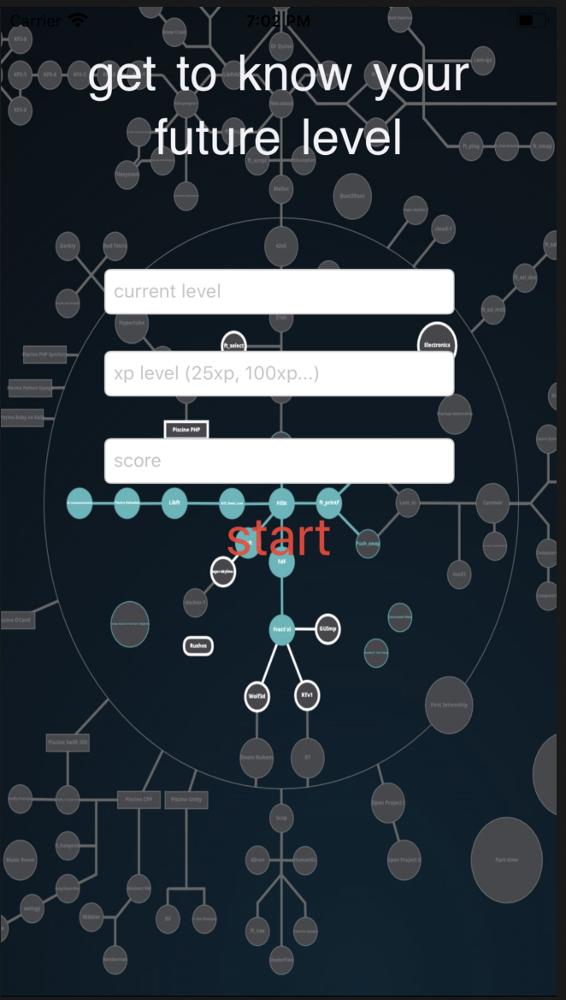
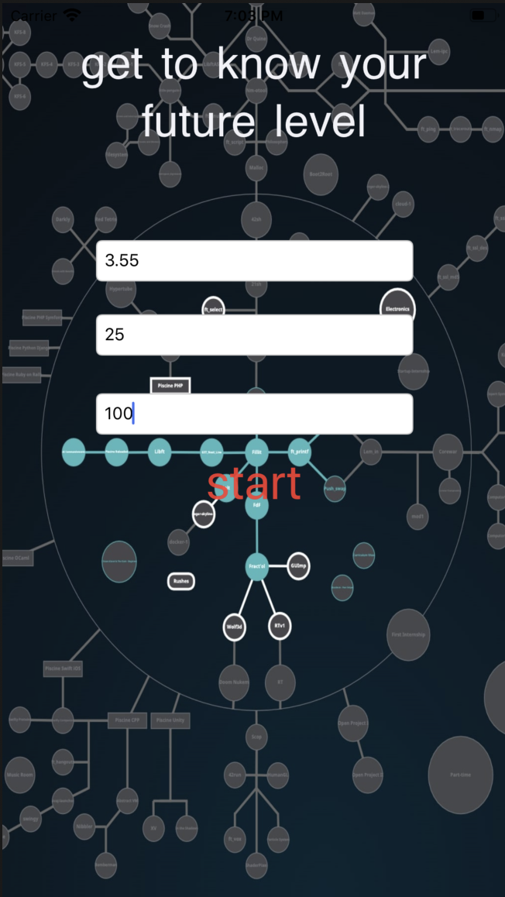
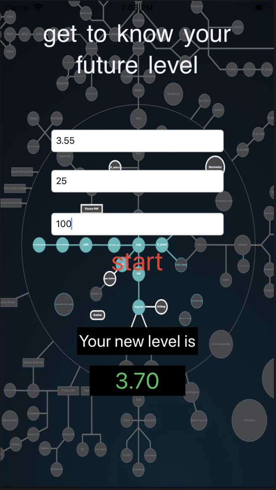

# Calculator-school-21
This calculator was created for students at School 21 to quickly calculate levels.

# Using
Fill in three fields. In the first field, enter the level from which you want to start the countdown. The second field is responsible for the number of xp that the project gives. In the third field enter how many points you plan to give the project.

Press "start" after all. You will see your future level.

